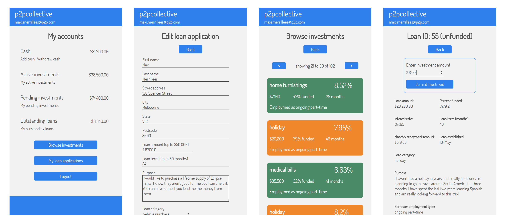

# Context

This is my first Rails app. I built it over the space of two weeks as part of my course. The project purpose was to create a two-sided marketplace with Ruby and the Rails framework. I decided to build a peer-to-peer lending platform because I suspected it would require a variety of different models and controllers, and so would be good web app development practice.

I managed to complete the app with most of the basic features. Users can add and withdraw cash, create loans, invest in other users' loans, and repay their outstanding loans. I originally had other features in mind but ran out of time to implement them.

I am happy with the outcome of the project, but next time I can improve through:
- Better implementation of associations between tables in the database
- Improving the efficiency of my database queries
- Better structuring of my layouts and views so I don't have to repeat a lot of CSS
- Limiting database queries to the controller, and not query the database from the views

# [p2pcollective.com](http://www.p2pcollective.com)

### p2pcollective is a convenient and low-cost peer-to-peer lending platform that matches borrowers and investors

### github repo: [https://github.com/maxitron93/p2pcollective.com](https://github.com/maxitron93/p2pcollective.com)

## 1. Traditional avenues for borrowing money is expensive and time consuming

People traditionally borrow money from banks. These banks charge high interest rates, of as high as 14% for personal loans and over 20% for credit card loans. On top of that, the process to borrow money can be time consuming and require large amounts of paper work. 

### Borrowers would prefer a faster, cheaper and more convenient way to borrow money:

### p2pcollective can satisfy most of their needs:

## 2. Retail investors do not traditionally have access to debt markets

Investors have few options to invest in debt securities. The bond market is only accessible to institutional investors so retail investors can only access them through index-style funds. This leaves a gap in the market for loans that retail investors can invest in directly. These types of investments offer an attractive risk-reward scenario for certain investors.

### Investors want the ability to quickly invest in diversified and secure investments:

### p2pcollective can provide the platform through which these investments can be made:

## 3. p2pcollective has been designed to meet the needs of both borrowers and investors

### Design notes:
This theme for this preliminary design is simplicity and ease of use. The intent is to create an uncluttered and inviting environment for users. The green and orange colours are only used in one place; the "Browse investments" section to clearly signal to the users that they are viewing potential investments.

The colour blue is used extensively throughout the app: #2F80ED

One font is used through the entire app: [Dosis](https://fonts.google.com/specimen/Dosis)

### Guests have access to the home page and information pages
The information pages have yet to be created

### The app does not explicitly distinguish between borrower and investor users. One user can be either or both. As such, they have access to the same views once they have logged in.

Borrowers have can create new loan applications and monitor its progress through their "my loan applications" page. This page mimics the life-cycle of a loan application, from creation, to submission, and finally assessment.

Investors can easily monitor their portfolio and access account histories just like a traditional bank. They can also study their investment options via the "browse investments" page.

## 4. The app is built on a robust database for storing user, loan and transaction records

There are four main sections of the database:

1. User-related tables (grey): These tables store information about individual users
2. Account and transaction-related tables (blue): These tables store user account information and store all transaction records of fund transfers between accounts
3. Loan application-related tables: These tables store information about user loan application. Applications are never deleted - the status is updated at various points along its life-cycle (creation, submission, assessment, approval) 
4. Active loan-related tables: An active loan is created when a loan application is approved. These are the loans that potential investors can access. These tables store information about the active loans, any investments made by investors and borrower repayments.

## 5. Take it for a spin

### Visit [p2pcollective.com](http://www.p2pcollective.com), sign up for an account and have a look around!

### For future development:

- Search functionality for investments
- Ability for app to track interest charges
- Ability for app to send emails
- Ability for app to automatically charge borrowers and pay investors
- Additional information pages